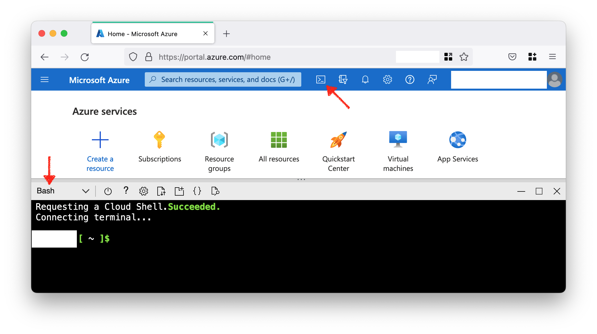

# How to Create Azure Service Principal

Open the [Azure Cloud Shell](https://learn.microsoft.com/en-us/azure/cloud-shell/overview) and select `Bash`.



Run the `az account show` command and make sure Azure Subscription you selected is your intended choice.

```console
az account show
```

Run the `az ad sp create-for-rbac` command to create a new Service Principal.  
After that, you should save the credential generated and outputted on the console.

```console
az ad sp create-for-rbac --name=provisioning-owner\
 --role="Owner"\
 --scopes=/subscriptions/$(az account show --query='id' --output=tsv)
```

```json
{
  "appId": "xxxxxxxx-0000-0000-0000-xxxxxxxxxxxx",
  "displayName": "provisioning-owner",
  "password": "********",
  "tenant": "zzzzzzzz-0000-0000-0000-zzzzzzzzzzzz"
}
```

## References

- [az account show](https://learn.microsoft.com/en-us/cli/azure/account#az-account-show)
- [az ad sp create-for-rbac](https://learn.microsoft.com/en-us/cli/azure/ad/sp#az-ad-sp-create-for-rbac)
